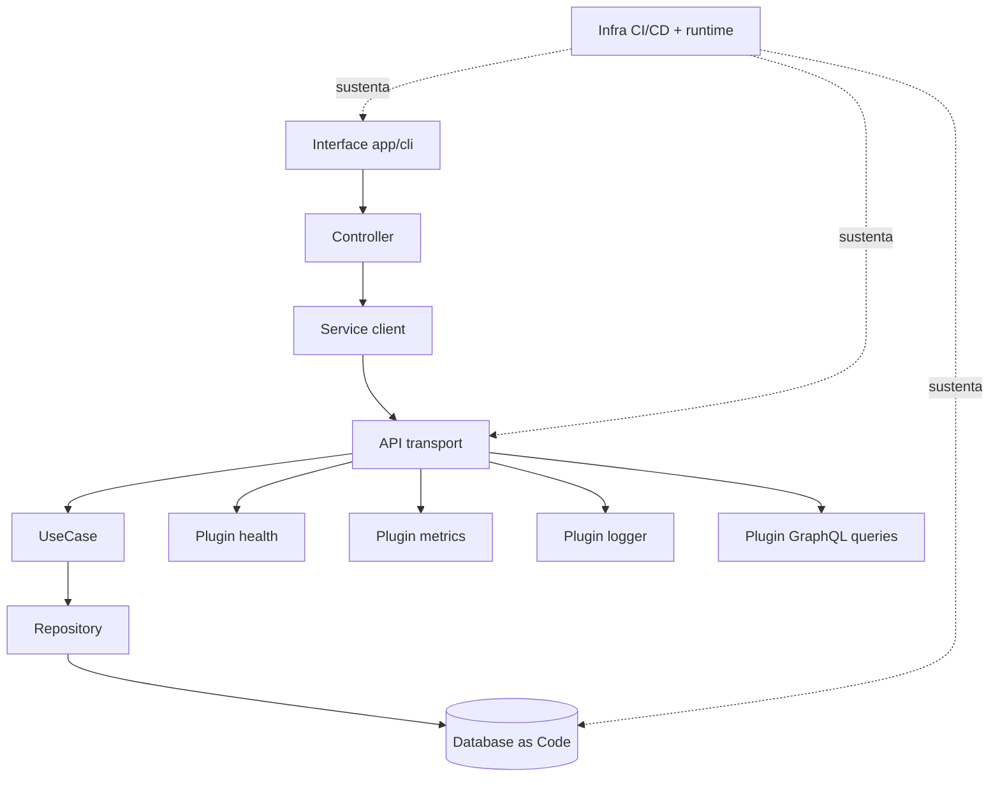

# Arquitectura canonica en diagrama

Este capitulo resume la arquitectura de MACSS en una vista unica, para entender su logica antes de entrar al detalle de implementacion.

## Vista de capas

## Reglas estructurales

1. La interfaz no habla directo con DB ni con terceros.
2. Todo comando o consulta entra por API y termina en UseCase.
3. Repository encapsula persistencia.
4. Plugins transversales no invaden la logica de negocio.
5. Infraestructura sostiene el sistema, no define la logica de dominio.

## Flujo canonico

1. El usuario interactua en Interface.
2. Controller coordina estado.
3. Service client llama API.
4. API enruta a UseCase.
5. UseCase orquesta reglas y acceso a datos.
6. Repository ejecuta operaciones de DB.
7. La respuesta vuelve por la misma cadena.

Este flujo es la referencia para revisar arquitectura, calidad y observabilidad.
