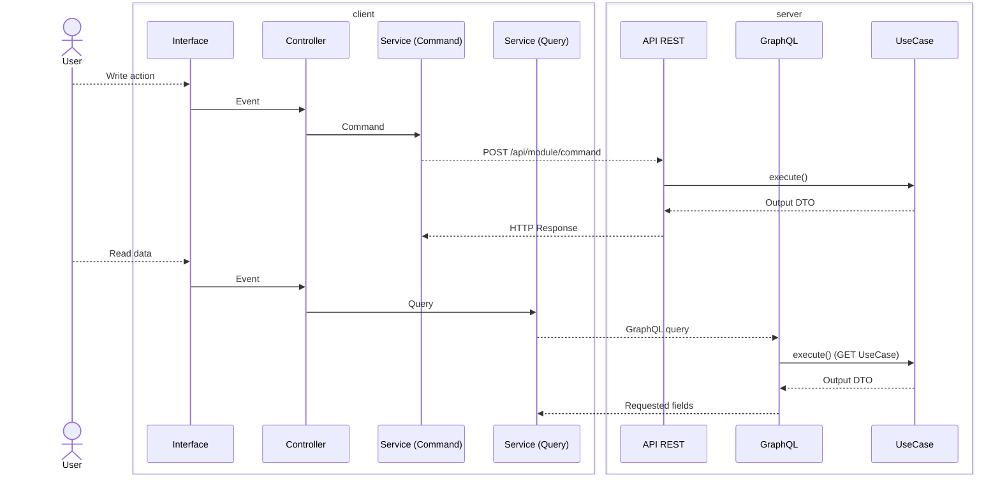

```mermaid
sequenceDiagram
    actor U as User
    box client
    participant UI as Interface
    participant C as Controller
    participant SC as Service (Command)
    participant SQ as Service (Query)
    end
    box server
    participant API as API REST
    participant GQL as GraphQL
    participant UC as UseCase
    end

    U-->>UI: Write action
    UI->>C: Event
    C->>SC: Command
    SC-->>API: POST /api/module/command
    API->>UC: execute()
    UC-->>API: Output DTO
    API-->>SC: HTTP Response

    U-->>UI: Read data
    UI->>C: Event
    C->>SQ: Query
    SQ-->>GQL: GraphQL query
    GQL->>UC: execute() (GET UseCase)
    UC-->>GQL: Output DTO
    GQL-->>SQ: Requested fields
```
