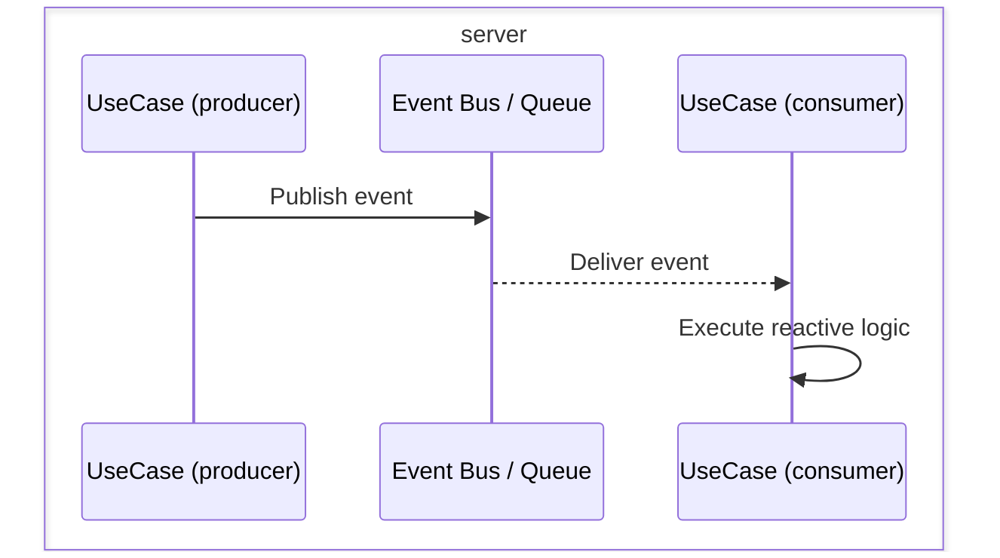

```mermaid
sequenceDiagram
    box server
    participant UC1 as UseCase (producer)
    participant BUS as Event Bus / Queue
    participant UC2 as UseCase (consumer)
    end

    UC1->>BUS: Publish event
    BUS-->>UC2: Deliver event
    UC2->>UC2: Execute reactive logic
```
