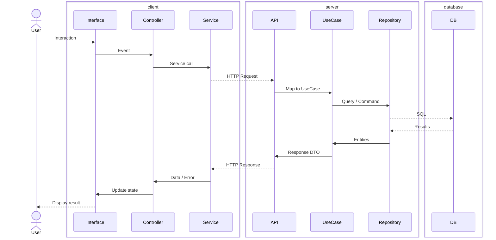

```mermaid
sequenceDiagram
    actor U as User
    box client
    participant UI as Interface
    participant C as Controller
    participant S as Service
    end
    box server
    participant API as API
    participant UC as UseCase
    participant REPO as Repository
    end
    box database
    participant DB as DB
    end

    U-->>UI: Interaction
    UI->>C: Event
    C->>S: Service call
    S-->>API: HTTP Request
    API->>UC: Map to UseCase
    UC->>REPO: Query / Command
    REPO-->>DB: SQL
    DB-->>REPO: Results
    REPO->>UC: Entities
    UC->>API: Response DTO
    API-->>S: HTTP Response
    S->>C: Data / Error
    C->>UI: Update state
    UI-->>U: Display result
```
