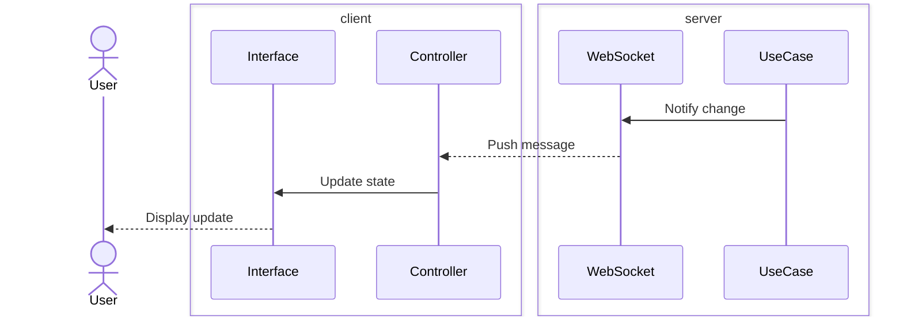

```mermaid
sequenceDiagram
    actor U as User
    box client
    participant UI as Interface
    participant C as Controller
    end
    box server
    participant WS as WebSocket
    participant UC as UseCase
    end

    UC->>WS: Notify change
    WS-->>C: Push message
    C->>UI: Update state
    UI-->>U: Display update
```
