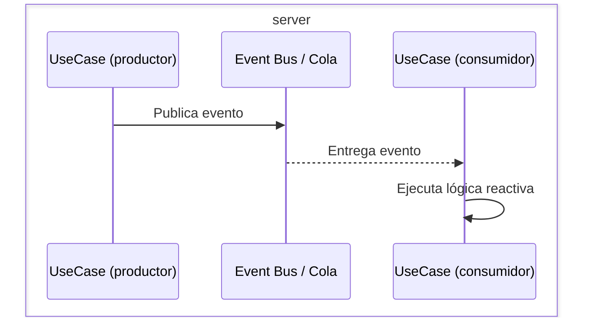
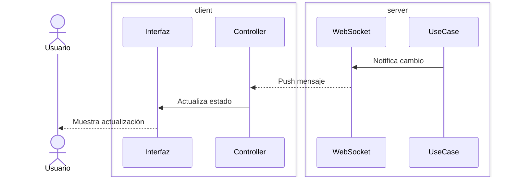

*Modular arquitecture for comprehensive software solutions*

Metodología/framework para desarrollo basada en: **arquitectura modular**, **especificación ejecutable** (tests/contratos) y **lazo cerrado** (verificación automática como sensor de error). Tiene la ventaja de ser favorable para desarrollo asistido por AI.

---
## Arquitectura de capas
---



```mermaid
sequenceDiagram
		actor U as Usuario
		box client
		participant UI as Interfaz
		participant C as Controller
		participant S as Service
		end
		box server
		participant API as API
		participant UC as UseCase
		participant REPO as Repository
		end
		box database
		participant DB as DB
		end

		U-->>UI: Interacción
		UI->>C: Evento
		C->>S: Llamada a Service
		S-->>API: HTTP Request
		API->>UC: Mapea a UseCase
		UC->>REPO: Consulta/Comando
		REPO-->>DB: Query SQL
		DB-->>REPO: Resultados
		REPO->>UC: Entidades
		UC->>API: Response DTO
		API-->>S: HTTP Response
		S->>C: Data/Error
		C->>UI: Actualiza estado
		UI-->>U: Muestra resultado
```

### Capas

- **interfaz**: Interfaz de usuario (UI o CLI) que presenta información y captura interacciones del usuario.
- **Controller**: Gestiona el estado de la aplicación y orquesta las llamadas entre la interfaz y los servicios.
- **Service (App)**: Capa de comunicación HTTP entre la aplicación cliente y el backend.
- **API**: Servidor backend que expone endpoints y coordina la ejecución de casos de uso.
- **UseCase**: Encapsula la lógica de negocio y coordina operaciones entre repositorios y servicios externos.
- **Repository**: Capa de acceso a datos que ejecuta consultas y comandos SQL.
- **DB**: Sistema de persistencia (SQL). Se gestiona como **Database as Code** (scripts DDL declarativos, sin ORMs ni migraciones incrementales).

---
## Módulos
---

Un **módulo** agrupa varios casos de uso relacionados que pertenecen al mismo dominio de negocio. El diagrama de capas muestra el flujo de *un* caso de uso; un módulo contiene varios de estos flujos.

Ejemplos: módulo de Clientes, módulo de Ventas, módulo de Inventario.

Cada módulo atraviesa todas las capas (corte vertical):

```
módulo Clientes/
├── db/          → tablas y scripts DDL del dominio
├── api/         → usecases, repositories, endpoints
└── ui/          → services, controllers, vistas
```

**Regla clave**: un módulo tiene fronteras explícitas y dependencias declaradas con otros módulos. Si un módulo crece lo suficiente, puede extraerse como microservicio sin cambiar la arquitectura interna.

---
## Cross-cutting concerns
---

Funcionalidades transversales que no pertenecen a un módulo de negocio específico pero son consumidas por todos:

- **Auth**: Autenticación y autorización (middleware en API, interceptor en client).
- **Config**: Configuración centralizada (variables de entorno, feature flags).
- **Logging / Observabilidad**: Logs estructurados, tracing, métricas.
- **Error handling**: Modelo de errores consistente entre capas.
- **Rate limiting / Circuit breakers**: Protección en comunicación HTTP (API → servicios externos).
- **CORS / Security headers**: Políticas de seguridad HTTP.

Estos concerns se implementan como middlewares (server) e interceptores (client), no como módulos de negocio.

---
## Flujos asíncronos
---

El diagrama principal muestra request-response síncrono. Para eventos y colas, el flujo cambia:

### Eventos (publish/subscribe)



Un UseCase publica un evento de dominio tras completar su operación. Otros UseCases suscritos reaccionan. El bus puede ser in-process (mismo API) o distribuido (RabbitMQ, Kafka, etc.).

### WebSocket (notificación push al cliente)



El WebSocket es un canal de notificación del servidor al cliente. No reemplaza el flujo HTTP — lo complementa para casos donde el cliente necesita reaccionar a cambios sin polling.
