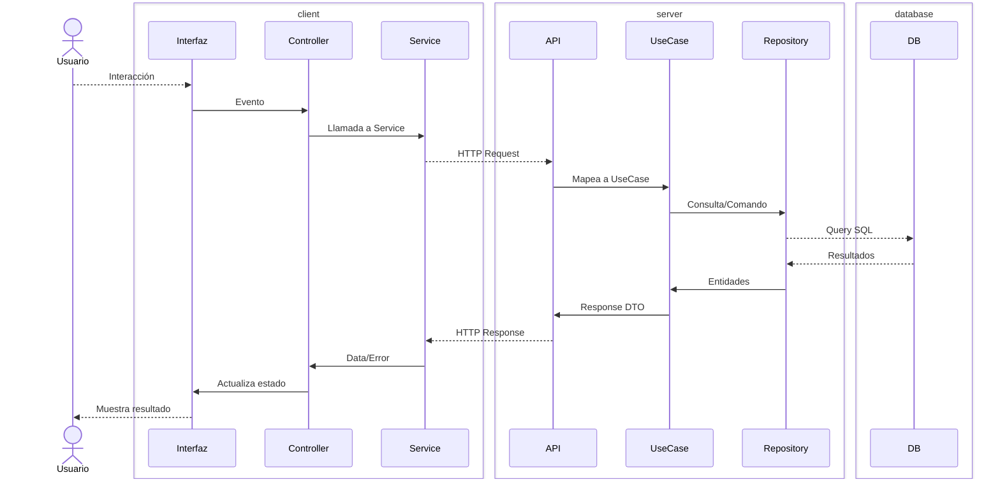
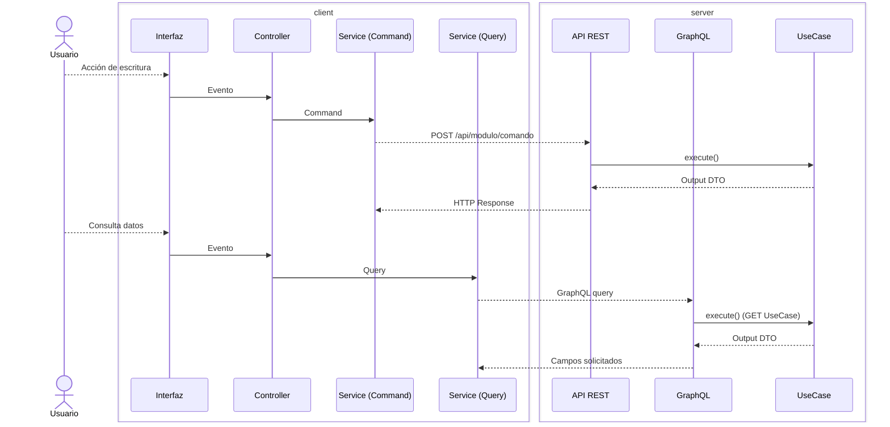
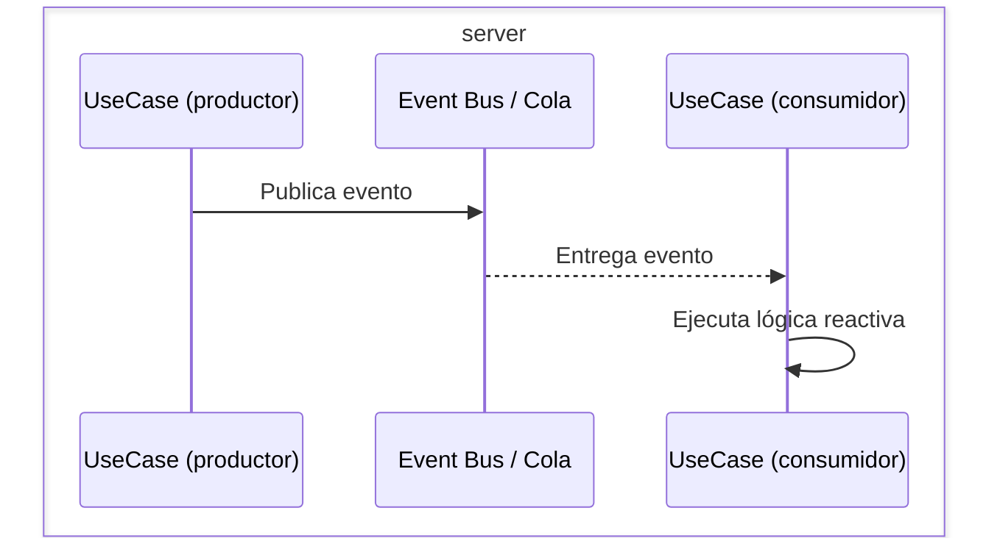
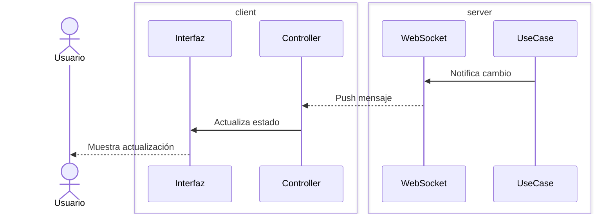

*Modular arquitecture for comprehensive software solutions*

Metodología/framework para desarrollo basada en: **arquitectura modular**, **especificación ejecutable** (tests/contratos) y **lazo cerrado** (verificación automática como sensor de error). Tiene la ventaja de ser favorable para desarrollo asistido por AI.

---
## Arquitectura de capas
---



### Capas

- **interfaz**: Interfaz de usuario (UI o CLI) que presenta información y captura interacciones del usuario.
- **Controller**: Gestiona el estado de la aplicación y orquesta las llamadas entre la interfaz y los servicios.
- **Service (App)**: Capa de comunicación HTTP entre la aplicación cliente y el backend.
- **API**: Servidor backend que expone endpoints y coordina la ejecución de casos de uso.
- **UseCase**: Encapsula la lógica de negocio y coordina operaciones entre repositorios y servicios externos.
- **Repository**: Capa de acceso a datos que ejecuta consultas y comandos SQL.
- **DB**: Sistema de persistencia (SQL). Se gestiona como **Database as Code** (scripts DDL declarativos, sin ORMs ni migraciones incrementales).

---
## Módulos y Slices
---

### Módulo

Un **módulo** agrupa varios casos de uso relacionados que pertenecen al mismo dominio de negocio, **dentro de una capa**. Cada capa (db, api, app, cli) organiza su código internamente en módulos.

```
api/
  modules/
    customers/     → usecases, repositories, endpoints del dominio Clientes
    sales/         → usecases, repositories, endpoints del dominio Ventas
    inventory/     → usecases, repositories, endpoints del dominio Inventario
```

Un módulo es la unidad organizativa dentro de una capa. Tiene fronteras explícitas y dependencias declaradas con otros módulos de la misma capa.

### Slice (rebanada)

Un **slice** es la unión lógica de los módulos homónimos a través de todas las capas. No es una carpeta — es un concepto mental y una restricción de coherencia.

```
slice "Customers" = db/modules/customers
                  + api/modules/customers
                  + app/modules/customers
                  + cli/modules/customers  (opcional)
```

La metáfora: la solución integral es un **pastel de capas**. Cada capa (db, api, app, cli) es un estrato horizontal. Un **slice** es una rebanada vertical que corta transversalmente todas las capas, ofreciendo la experiencia funcional completa de un dominio de negocio.

```
        ┌─────────────────────────────────────┐
  app   │  customers  │   sales   │ inventory │  ← capa (presentación)
        ├─────────────┼───────────┼───────────┤
  api   │  customers  │   sales   │ inventory │  ← capa (lógica)
        ├─────────────┼───────────┼───────────┤
  db    │  customers  │   sales   │ inventory │  ← capa (datos)
        └─────────────┴───────────┴───────────┘
        ◄── slice ───►
```

**Reglas clave**:
- Si existe `api/modules/X/`, debe existir `db/modules/X/`.
- Cada slice tiene fronteras explícitas y dependencias declaradas con otros slices.
- Si un slice crece lo suficiente, puede extraerse como microservicio sin cambiar la arquitectura interna — se toma la rebanada completa y se despliega aparte.

---
## Cross-cutting concerns
---

Funcionalidades transversales que no pertenecen a un módulo de negocio específico pero son consumidas por todos:

- **Auth**: Autenticación y autorización (middleware en API, interceptor en client).
- **Config**: Configuración centralizada (variables de entorno, feature flags).
- **Logging / Observabilidad**: Logs estructurados, tracing, métricas.
- **Error handling**: Modelo de errores consistente entre capas.
- **Rate limiting / Circuit breakers**: Protección en comunicación HTTP (API → servicios externos).
- **CORS / Security headers**: Políticas de seguridad HTTP.

Estos concerns se implementan como middlewares (server) e interceptores (client), no como módulos de negocio.

---
## CQRS — Command Query Responsibility Segregation
---

MACSS adopta CQRS como principio arquitectónico estructural. No es una guía de estilo — es una restricción que el framework enforza a través de protocolos distintos:

| Tipo | Transporte | Descripción |
|------|-----------|-------------|
| **Command** (escritura) | REST / HTTP | POST, PUT, PATCH, DELETE. Cada endpoint mapea a un UseCase que muta estado. Validación estricta via `validate()` + Input DTO. |
| **Query** (lectura) | GraphQL | El cliente solicita exactamente los campos que necesita. Sin over-fetching. GraphQL se genera automáticamente desde los UseCases GET. |



**Reglas**:
- Los UseCases GET son queries puras — no mutan estado.
- Los UseCases POST/PUT/PATCH/DELETE son commands.
- El plugin GraphQL solo monta los UseCases GET como resolvers.
- Toda lógica pasa por UseCase, sea REST o GraphQL — un solo punto de auditoría.
- El contrato entre server y client es: OpenAPI para commands, GraphQL Schema para queries.

---
## Flujos asíncronos
---

El diagrama principal muestra request-response síncrono. Para eventos y colas, el flujo cambia:

### Eventos (publish/subscribe)



Un UseCase publica un evento de dominio tras completar su operación. Otros UseCases suscritos reaccionan. El bus puede ser in-process (mismo API) o distribuido (RabbitMQ, Kafka, etc.).

### WebSocket (notificación push al cliente)



El WebSocket es un canal de notificación del servidor al cliente. No reemplaza el flujo HTTP — lo complementa para casos donde el cliente necesita reaccionar a cambios sin polling.
