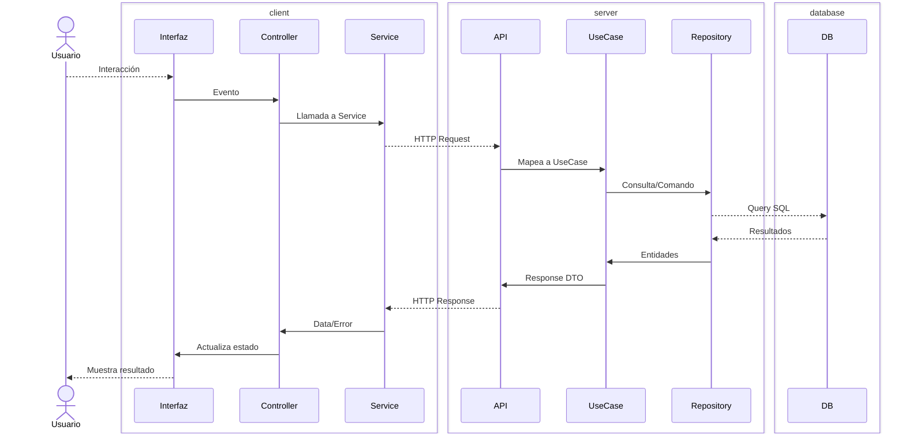

*Modular arquitecture for comprehensive software solutions*

Metodología/framework para desarrollo basada en: **arquitectura modular**, **especificación ejecutable** (tests/contratos) y **lazo cerrado** (verificación automática como sensor de error). Tiene la ventaja de ser favorable para desarrollo asistido por AI.

---
## Arquitectura de capas
---

### Capas

- **interfaz**: Interfaz de usuario (UI o CLI) que presenta información y captura interacciones del usuario.
- **Controller**: Gestiona el estado de la aplicación y orquesta las llamadas entre la interfaz y los servicios.
- **Service (App)**: Capa de comunicación HTTP entre la aplicación cliente y el backend.
- **API**: Servidor backend que expone endpoints y coordina la ejecución de casos de uso.
- **UseCase**: Encapsula la lógica de negocio y coordina operaciones entre repositorios y servicios externos.
- **Repository**: Capa de acceso a datos que ejecuta consultas y comandos SQL.
- **DB**: Sistema de persistencia (SQL).
